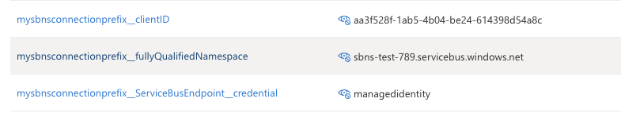
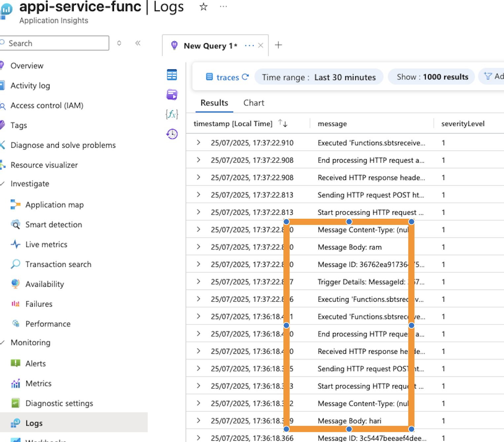

# func-container

This repository contains Azure Functions using .NET 8 isolated worker model.

## Features

- **HTTP Trigger Functions**: Respond to HTTP requests.
- **Service Bus Trigger Functions**: Process messages from Azure Service Bus topics/subscriptions.

## Project Structure

- `helloworld.cs`: Example HTTP-triggered function.
- `sbtsreceiver.cs`: Service Bus topic/subscription triggered function.
- `Program.cs`: Function host startup.
- `local.settings.json`: Local development settings (not for production).
- `Dockerfile`: Containerization support.

## Local Development

1. **Install prerequisites**:
   - [.NET 8 SDK](https://dotnet.microsoft.com/download)
   - [Azure Functions Core Tools](https://docs.microsoft.com/azure/azure-functions/functions-run-local)
2. **Configure local settings**:
   - Update `local.settings.json` with your Service Bus and storage connection strings.
3. **Run locally**:
   ```bash
   func start
   ```
4. **Build and run in Docker**: (only http will work, since az cli access wont be in container)
   ```bash
   docker build -t func-container .
   docker run -p 8080:80 func-container
   ```

## Deployment

Deploy using Azure CLI, VS Code, or GitHub Actions.

## Connection to service bus via azure cli in local development
To connect to Azure Service Bus while running locally, you can use the Azure CLI to set up your environment. Ensure you have the Azure CLI installed and logged in.

```
{
  "IsEncrypted": false,
  "Values": {
    "AzureWebJobsStorage": "UseDevelopmentStorage=true",
    "FUNCTIONS_WORKER_RUNTIME": "dotnet-isolated",
    "mysbnsconnectionprefix__fullyQualifiedNamespace": "sbns-test-789.servicebus.windows.net"
  }
}

```

In service bus function code , in the `Connection=mysbnsconnectionprefix` attributeis prefix of the env values 


mysbnsconnectionprefix__fullyQualifiedNamespace=sbns-test-789.servicebus.windows.net in local.settings.json

## Deploy to Azure functions 

1. Create an ACR and publish image to ACR 
2. Create a function app with the container image from ACR
3. craete identity for the function app
4. Assign the identity to the service bus topic/subscription with `Azure Service Bus Data Receiver`
 role
5. Assign the identity to the ACR with `AcrPull` role

6. ENV needed in azure function app



7. Create a service bus topic and subscription
8. Use service bus explorer to send messages to the topic
9. Enable application inights for the function app to monitor the function execution
10. message can be seen in logs

